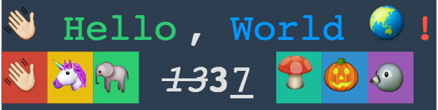
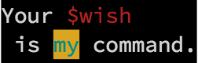
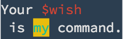
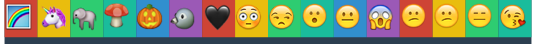
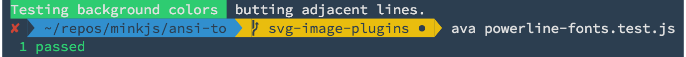
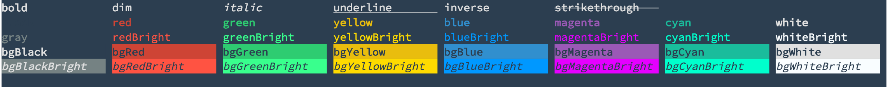
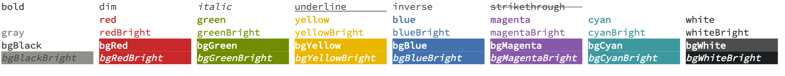
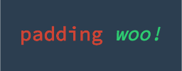
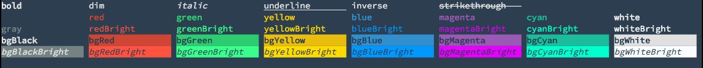

# ansi-to-image

> 😹 convert ANSI Escaped CLI strings to PNG, JPEG

[](https://travis-ci.org/F1LT3R/ansi-to-image)
[](https://coveralls.io/github/F1LT3R/ansi-to-image?branch=master)
[](https://www.npmjs.com/package/ansi-to-image)
[](https://github.com/sindresorhus/xo)

ANSI-to-Image provides a Markdown friendly way to include Node.js CLI output in your software documentation; like this PNG here:

[](examples/hello-world.png)

ANSI-to-SVG sits on top of tha base-package [ANSI-to](https://github.com/F1LT3R/ansi-to) and is part of a collection of tools used for ZDD development.

## Install

```
$ yarn add ansi-to-svg
```

## Usage

```js
const ansiToImage = require('ansi-to-image')

ansiToImage(ansiText, {
	// Path to output file (required)
	filename: 'path/to/output/image.jpg',

	// Image types: [jpeg, png],
	type: 'jpeg',

	// Image compression quality (only relevant for jpeg)
	quality: 60,

	// Defaults to  2x for Retina compatibility
	scale: 2,

	// Font settings
	fontFace: 'Courier',
	fontSize: 14,
	lineHeight: 18,

	// Padding
	paddingTop: 0,
	paddingLeft: 0,
	paddingBottom: 0,
	paddingRight: 0,

	// Supply an iTerm2 Color file
	colors: './base16-flat-dark-f1lt3r-256.itermcolors',

	// Or override the default colors'
	// (all defaults shown here)
	colors: {
		black: '#000000',
		red: '#B22222',
		green: '#32CD32',
		yellow: '#DAA520',
		blue: '#4169E1',
		magenta: '#9932CC',
		cyan: '#008B8B',
		white: '#D3D3D3',
		gray: '#A9A9A9',
		redBright: '#FF4500',
		greenBright: '#ADFF2F',
		yellowBright: '#FFFF00',
		blueBright: '#87CEEB',
		magentaBright: '#FF00FF',
		cyanBright: '#00FFFF',
		whiteBright: '#FFFFFF',
		bgBlack: '#000000',
		bgRed: '#B22222',
		bgGreen: '#32CD32',
		bgYellow: '#DAA520',
		bgBlue: '#4169E1',
		bgMagenta: '#9932CC',
		bgCyan: '#008B8B',
		bgWhite: '#D3D3D3',
		bgGray: '#A9A9A9',
		bgRedBright: '#FF0000',
		bgGreenBright: '#ADFF2F',
		bgYellowBright: '#FFFF00',
		bgBlueBright: '#87CEEB',
		bgMagentaBright: '#FF00FF',
		bgCyanBright: '#00FFFF',
		bgWhiteBright: '#FFFFFF',
		backgroundColor: '#000000',
		foregroundColor: '#D3D3D3'
	}
})
```

## Basic Text

```js
const ansiToImage = require('ansi-to-image')
const chalk = require('chalk')
const ansiText = chalk`Your {red $wish}\n is {bgYellow.cyan my} command.`

const result = ansiToImage(ansiText, {
	filename: 'examples/basic-example.png'
})
```

[](examples/basic-example.png)

## iTerm2 Color Support

Using: [./fixtures/base16-flat-dark-f1lt3r-256.itermcolors](./fxitures/base16-flat-dark-f1lt3r-256.itermcolors)

```js
const ansiText = chalk`Your {red $wish}\n is {bgYellow.cyan my} command.`
const colorFile = 'base16-flat-dark-f1lt3r-256.itermcolors'

ansiToSVG(ansiText, {
	color: colorFile,
	filename: 'examples/iterm2colors-file.png'
})
```

[](examples/iterm2colors-file.png)

## Emoji Support

```js
const ansiText = chalk.bgRed('🌈') +
	chalk.bgYellow('🦄') +
	chalk.bgGreen('🐘') +
	chalk.bgCyan('🍄') +
	chalk.bgBlue('🎃') +
	chalk.bgMagenta('🐦') +
	chalk.bgRed('🖤') +
	chalk.bgYellow('😳') +
	chalk.bgGreen('😒') +
	chalk.bgCyan('😮') +
	chalk.bgBlue('😐') +
	chalk.bgMagenta('😱') +
	chalk.bgRed('😕') +
	chalk.bgYellow('😕') +
	chalk.bgGreen('😑') +
	chalk.bgCyan('😘')

ansiToSVG(ansiText, {
	filename:
	colors: 'base16-flat-dark-f1lt3r-256.itermcolors'
})
```

[](examples/emojis.png)

## Powerline Font Compatability

```js
const ansiText = chalk` {bgGreen.white Testing background colors } butting adjacent lines. \n` +
	chalk` {red ✘ }{bgBlue.black  ~/repos/minkjs/ansi-to }{bgYellow.blue  }{bgYellow.black  svg-image-plugins ● }{yellow } ava powerline-fonts.test.js \n` +
	chalk`  {green 1 passed}`

ansiToSVG(ansiText, {
	filename: 'examples/powerline-font.png',
	colors: 'base16-flat-dark-f1lt3r-256.itermcolors',
	fontFamily: 'SauceCodePro Nerd Font'
})
```

Note: you will need `SauceCodePro Nerd font` for the following example to render correctly. You can find Nerd Fonts here: [https://nerdfonts.com/](https://nerdfonts.com/)

[](examples/powerline-font.png)

## All Styles

If we dump some ANSI to a file: [fixture.chalk-styles.ansi](fixtures/fixture.chalk-styles.ansi)

```plaintext
bold             dim              italic           underline        inverse          strikethrough    
black            red              green            yellow           blue             magenta          cyan             white            
gray             redBright        greenBright      yellowBright     blueBright       magentaBright    cyanBright       whiteBright      
bgBlack          bgRed            bgGreen          bgYellow         bgBlue           bgMagenta        bgCyan           bgWhite          
bgBlackBright    bgRedBright      bgGreenBright    bgYellowBright   bgBlueBright     bgMagentaBright  bgCyanBright     bgWhiteBright    
```

We can render it with `ansiToImage`:

```js
const ansiText = String(fs.readFileSync('all-supported-styles.ansi'))

ansiToImage(ansiText, {
	filename: 'examples/chalk-base-styles.png',
	colors: 'base16-flat-dark-f1lt3r-256.itermcolors'
})
```

Resulting in the following output:

[](examples/chalk-base-styles.png)

Note: this example uses [Chalk](https://github.com/chalk/chalk) as a base to write the ANSI Escape sequences.

## Light Color Scheme

```js
ansiToSVG(ansiText), {
	filename: 'examples/light-iterm2-color-scheme.png',
	colors: 'base16-tomorrow-256.itermcolors'
})
```

[](examples/light-iterm2-color-scheme.png)


## Padding

```js
const ansiText = chalk`{red.bold padding} {green.italic woo!}`
const colorFile = './fixtures/base16-flat-dark-f1lt3r-256.itermcolors'

const result = ansiToImage(ansiText, {
	filename: 'examples/padding.png'
	colors: colorFile,
	paddingTop: 14,
	paddingLeft: 14,
	paddingRight: 14,
	paddingBottom: 14
})
```

[](examples/padding.png)


## JPEG Output

```js
ansiToImage(ansiText, {
	filename: 'examples/jpeg-0-percent-quality.jpg'
	colors: './fixtures/base16-flat-dark-f1lt3r-256.itermcolors',
	type: 'jpeg',
	quality: 0,
	scale: 1
})
```

[](examples/jpeg-0-percent-quality.jpg)
